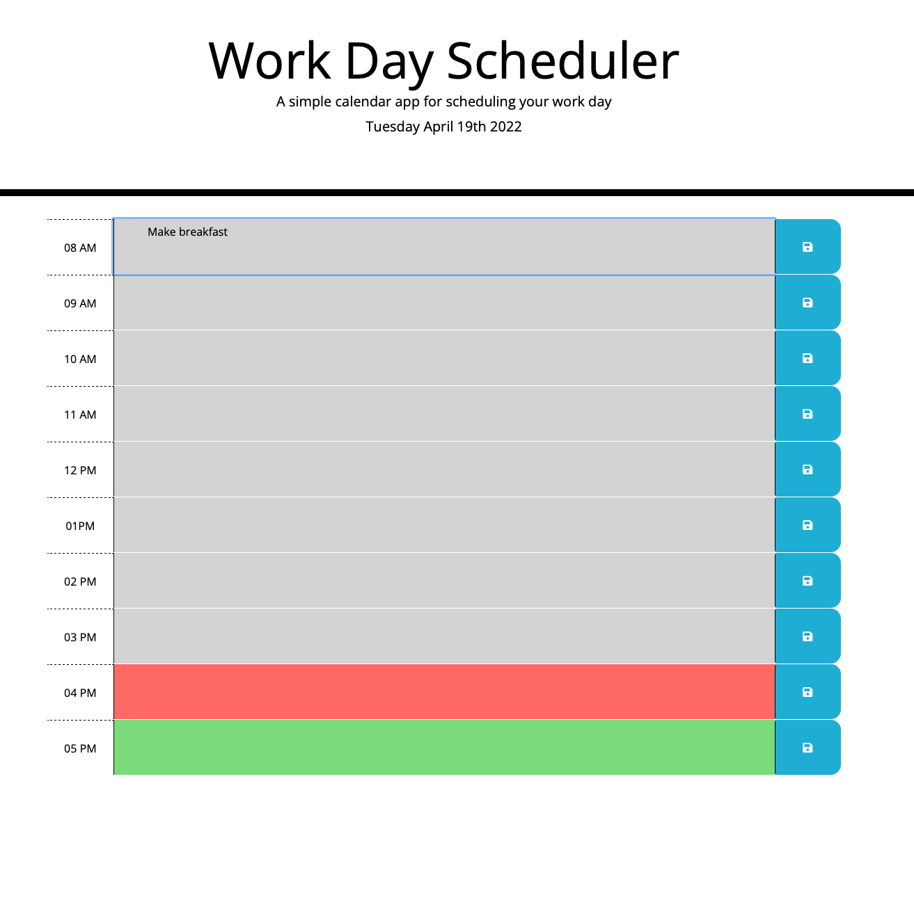

# Work day scheduler

## Purpose
An application that allows the user to plan out their work day and saving it to a set schedule, without having to re-enter their agenda everyday. It also uses 
color coordination to block out present, past and future hours of the day.

## Built With
* HTML
* CSS
* Jquery
* Moment.js
* Bootstrap

## Demo

## Website
https://lukesturgill.github.io/work-day-schedule/

## Contribution
Luke Sturgill